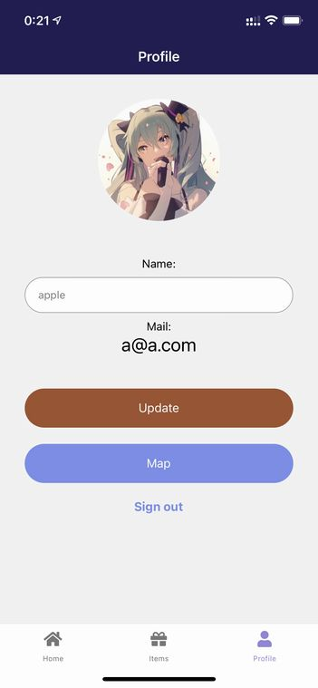
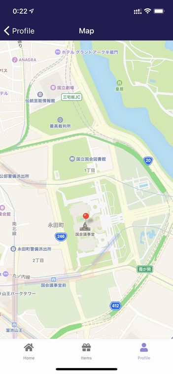
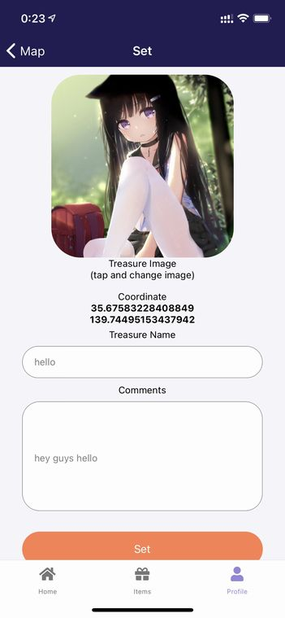

# 宝箱を作ろう

アプリにログインしたらまずは宝箱を設置しましょう。

あなたの設置した宝箱に他のユーザーが接近するとそのユーザーに宝箱の存在が通知されます。

ユーザーが宝箱を取得するとあなたに通知されます。

## プロフィールを作る

あなたのプロフィールを作りましょう。

ボトムタブの**Profile**をタップするとプロフィール画面になります。

アバター画像と名前は他のユーザーに公開されます。メールアドレスは非公開です。

アバターをタップすると画像を変更することができます。

Nameは任意に設定できます。

入力が完了したら**Update**をタップしてプロフィールを更新しましょう。

## 宝箱を設置する

プロフィール画面の**Map**をタップすると宝箱を設置する座標を選択する画面になります。

マップ上の宝箱を設置したい箇所をタップするとマーカーが表示されます。

マーカーをタップすると宝箱を設定する画面に移動します。

宝箱の名前、コメント、画像を設定しましょう。

宝箱の情報と座標は宝箱を発見したユーザーに公開されます。

宝箱は最大10個まで設置できます。

**以上で宝箱の設置は完了です。**