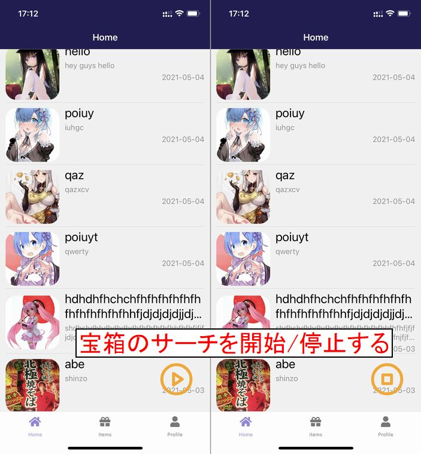
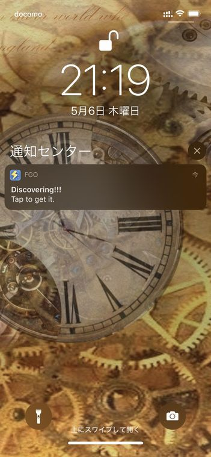
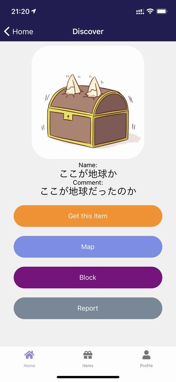
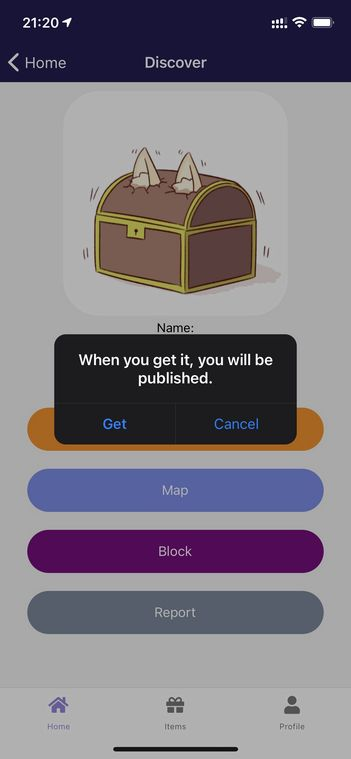
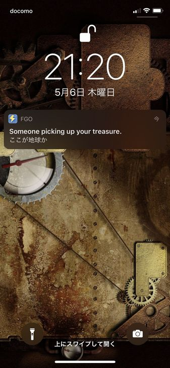

# 宝箱を取得しよう

他のユーザーが設置した宝箱を取得しましょう。

## 宝箱のサーチを開始する

**Home**画面右下の再生/停止ボタンをタップすると宝箱のサーチが開始/停止されます。

## 通知を確認する

設置された宝箱に接近すると、宝箱を発見したことが通知されます。

## 見つけた宝箱を見てみよう

通知をタップするとその宝箱の情報が表示されます。

**Map**をタップするとその宝箱の座標を地図上で確認できます。

**Block**をタップするとその宝箱をブロックします。

**Report**をタップするとその宝箱を運営に報告します。

## 宝箱を取得しよう

**Get this item**をタップするとその宝箱を取得するか確認ダイアログが表示されます。

ダイアログの**Get**を選択すると、その宝箱が取得した宝箱リストに追加されます。

## 宝箱を設置したユーザーに通知されます

ユーザーが宝箱を**Get**すると、その宝箱を設置したユーザーに、誰かが自分の宝箱を取得したことが通知されます。

