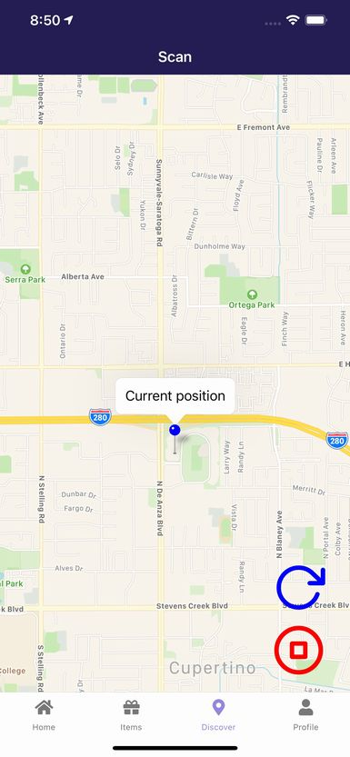
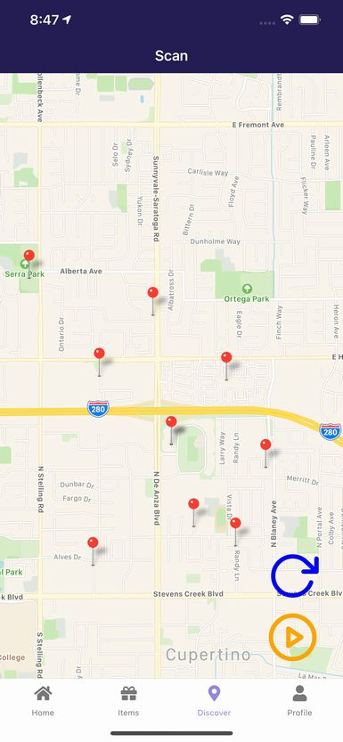
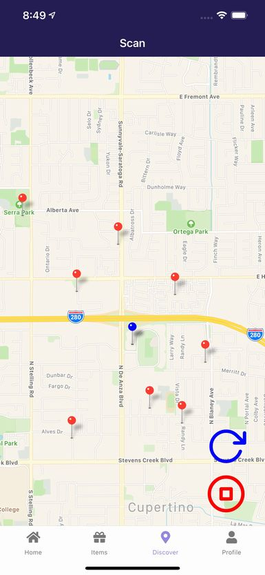

# 宝箱を取得しよう

他のユーザーが設置した宝箱を取得しましょう。

## 宝箱のサーチを開始する

ボトムタブの**Discover**を開くとマップが開きます。現在地の座標が青いマーカーで表示されます。

右下の**更新アイコン**をタップすると周辺の宝箱を示す赤いマーカーが表示されます。

ただし以下は表示されません。

- 自分の宝箱
- 取得済みの宝箱
- ブロックした宝箱

オレンジの**再生アイコン**をタップすると**宝箱を探すモード**(ジオフェンスが開始)になります。

**停止アイコン**をタップすると**宝箱を探すモードがオフ**になります。また**宝箱を探すモードの時に更新を実行した時**にもオフになります。

赤いマーカーとして表示されていない宝箱に接近しても通知はされないため**定期的に更新**する必要があります。

## 通知を確認する

設置された宝箱に接近すると、宝箱を発見したことが通知されます。

## 見つけた宝箱を見てみよう

通知をタップするとその宝箱の情報が表示されます。

**Map**をタップするとその宝箱の座標を地図上で確認できます。

**Block**をタップするとその宝箱をブロックします。

**Report**をタップするとその宝箱を運営に報告します。

## 宝箱を取得しよう

**Get this item**をタップするとその宝箱を取得するか確認ダイアログが表示されます。

ダイアログの**Get**を選択すると、その宝箱が取得した宝箱リストに追加されます。

## 宝箱を設置したユーザーに通知されます

ユーザーが宝箱を**Get**すると、その宝箱を設置したユーザーに、誰かが自分の宝箱を取得したことが通知されます。

