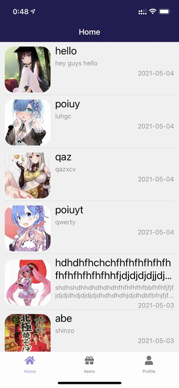
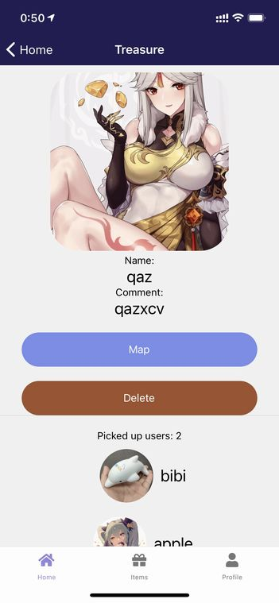
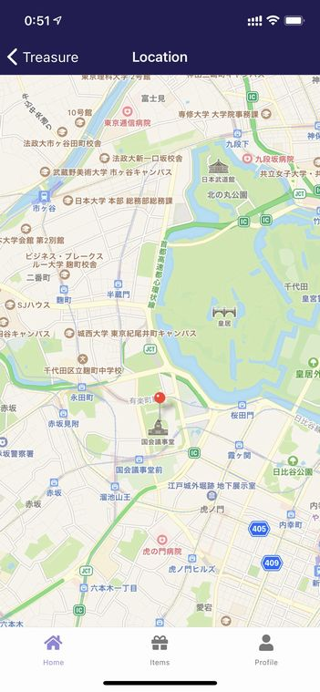

# 自分の宝箱を管理しよう

## 設置した宝箱の一覧

ボトムタブの**Home**を開くとあなたが設置した宝箱の一覧が表示されます。

## 宝箱の情報

一覧から各宝箱をタップすると詳細を確認できます。

あなたが設定した宝箱の名前、コメント、画像が表示されます。

**Picked up users**にはその宝箱を取得したユーザーが表示されます。

## 宝箱の座標

**Map**をタップすると宝箱の座標が地図上に表示されます。

## 宝箱の削除

**Delete**ボタンをタップすることでいつでも宝箱を削除することができます。サーバーから削除されるため他のユーザーにも表示されなくなります。