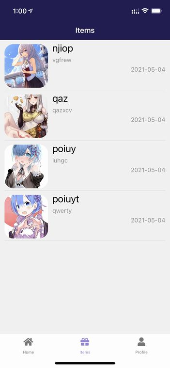
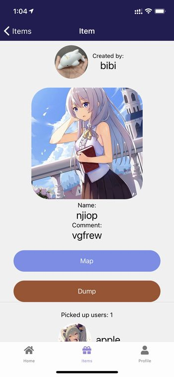
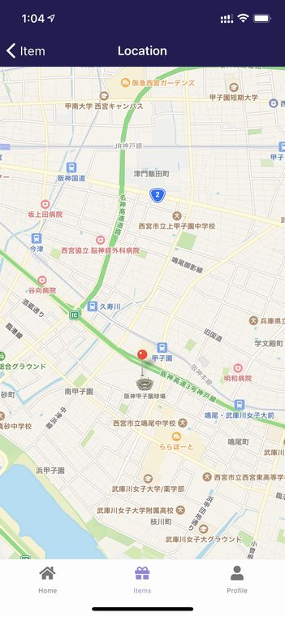

# 取得した宝箱を見てみよう

## 取得した宝箱の一覧

ボトムタブの**Items**を開くとあなたが取得した宝箱の一覧が表示されます。

## 宝箱の情報

一覧から各宝箱をタップすると詳細を確認できます。

宝箱の名前、コメント、画像を確認できます。

画面上部には宝箱の作者が表示されます。

画面下部の**Picked up users**にはその宝箱を取得したユーザーが表示されます。

## 宝箱の座標

**Map**をタップすると宝箱の座標が地図上に表示されます。

## 宝箱を放棄する

**Dump**ボタンをタップすることでいつでも宝箱を放棄することができます。

放棄した宝箱はあなたの**Items**一覧から削除されます。